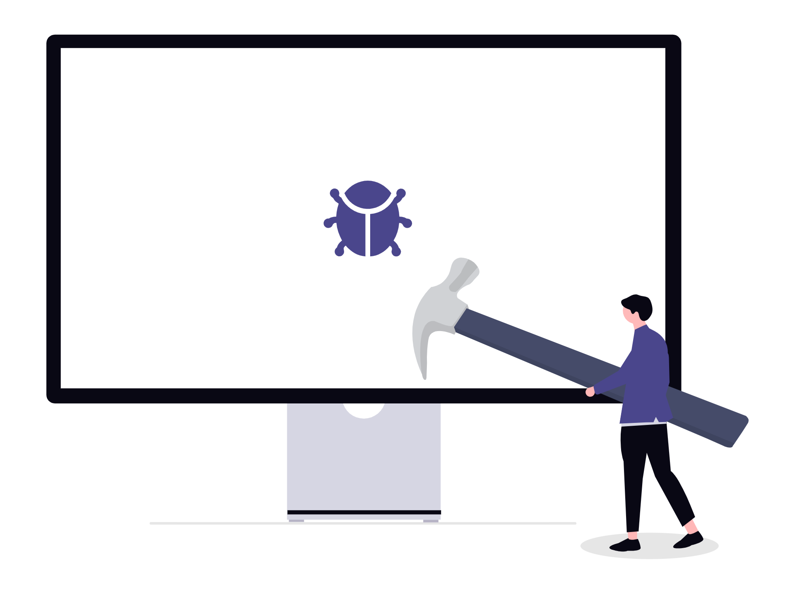

# Rick and Morty Characters App

<p align="left">
  
  
  
  
</p>

A portfolio-ready Flutter application that fetches and displays Rick and Morty characters with search, detailed profiles, and animated facts. The project is structured with clear architecture and state management to reflect production-style mobile development.

## Project Overview

### Problem
Build a responsive, API-driven mobile app that handles async data, user search, loading states, and network interruptions in a clean and maintainable way.

### Solution
Implemented a layered Flutter app using Cubit (`flutter_bloc`) with a repository + web service data flow, clear route handling, and an engaging UI experience.

## Key Features

- Responsive 2-column character grid
- Real-time character name search
- Character details page with Hero animation
- Animated random facts/quotes
- Offline-aware UI with clear no-internet state
- Loading indicators for improved UX feedback

## Tech Stack

### Mobile Development
- Flutter
- Dart

### State Management
- flutter_bloc (Cubit)

### Backend Integration
- REST API consumption with Dio

### Tools & Libraries
- flutter_offline
- animated_text_kit
- flutter_lints

## Screenshots

> Replace or extend these with app screenshots from device/emulator captures.

| State | Preview |
|---|---|
| Loading |  |
| Offline |  |
| Placeholder |  |

## Architecture

The app follows a simple layered structure:

- **Presentation**: screens and widgets
- **Business Logic**: Cubit + states
- **Data**: repository, models, and web services

Data flow:
1. UI triggers Cubit method
2. Cubit requests data from repository
3. Repository fetches API data via web service
4. Cubit emits states to update UI

## APIs Used

- Characters: `https://rickandmortyapi.com/api/character`
- Facts feed (temporary placeholder source): `https://catfact.ninja/facts?limit=10`

## Getting Started

### Prerequisites

- Flutter SDK
- Dart SDK `^3.9.2`
- Android Studio / VS Code + emulator or real device

### Installation

```bash
flutter pub get
```

### Run

```bash
flutter run
```

### Static Analysis & Tests

```bash
flutter analyze
flutter test
```

## Future Improvements

- Add dedicated project screenshots for home/details/search flows
- Add pagination or lazy loading for character data
- Replace placeholder facts API with a character-themed quotes/facts source
- Add unit and widget tests for Cubit and UI states

## Repository Structure

```text
lib/
  Business_logic/
  Data/
  Presentation/
  constants/
  app_router.dart
  main.dart
Assets/images/
```
